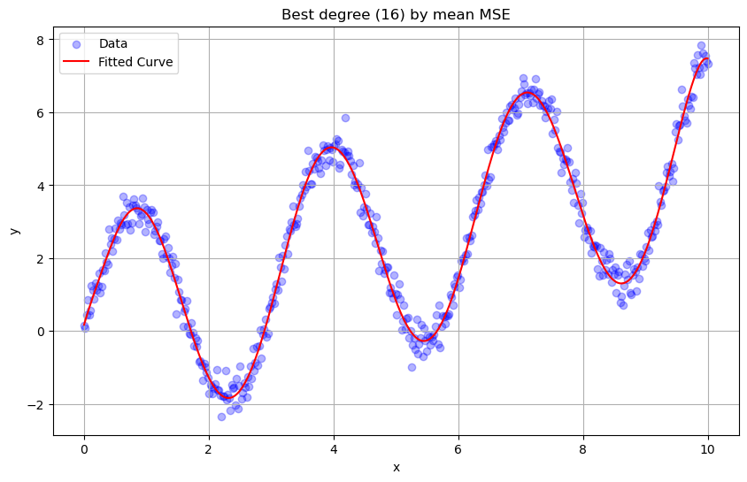
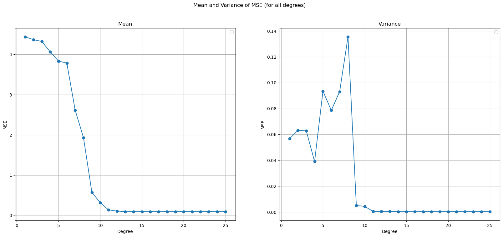

# Polynomial Regression Cross-Validation Simulation

📊 **Project Summary**
This project performs a simulation study on polynomial regression models with degrees ranging from 1 to 25, evaluated using 10-fold cross-validation. The objective is to understand how model complexity impacts bias, variance, and generalization error.
<p align="center">
  
</p>


## 🚀 Problem Statement

**Simulation Task:**
- Generate data as follows:
```python
  x = np.linspace(0, 10, 500)
  e = np.random.normal(0, 0.3, x.shape[0])
  y = 3 * np.sin(2 * x) + 0.5 * x + e
```
- Randomly split the data into 10 folds.

- For each degree from 1 to 25:

- Perform 10-fold cross-validation.

- In each fold, fit a polynomial regression model of the given degree on 9 folds, and evaluate on the remaining fold using Mean Squared Error (MSE).

- At the end, for each degree, you will have 10 MSE values.

- Compute the mean and variance of these 10 MSE values for each polynomial degree.

## 📈 Results
🔍 Mean & Variance of MSE
The simulation tracks how the average test error (mean MSE) and variance of test error change as the polynomial degree increases.

🥇 Best & Worst Models
Based on:

Lowest mean MSE (best fit on average).

Highest variance (unstable / overfitting).

## 🛠 How to Run
```bash
pip install numpy matplotlib scikit-learn
python src/main.py
```
Ensure you have:

> numpy for array and math operations.

> matplotlib for plotting.

> scikit-learn for polynomial features, scaling, and cross-validation.

## 📝 Key Learnings
- Increasing the polynomial degree improves training fit but increases variance on unseen data.

- Bias-variance trade-off is clearly visualized:

- Low-degree polynomials underfit (high bias, low variance).

- High-degree polynomials overfit (low bias, high variance).
<p align="center">
  
</p>

## 📚 License
This project is open source under the MIT License.

