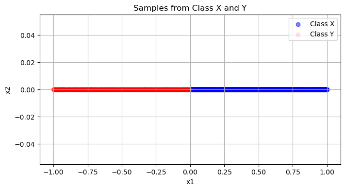

# KNN Simulation Project

## 📌 Problem Statement

This project involves a series of experiments to explore the behavior of the **K-Nearest Neighbors (KNN)** classifier under different conditions.

The tasks are as follows:

### 1️⃣ Simulation with Uniform Data
- Generate `2000` samples from class `X`:
  - $x = [u, 0]$ where $u \sim U(0, 1)$
- Generate `2000` samples from class `Y`:
  - $y = [0, z]$ where $z \sim U(-1, 0)$
- Randomly split the data into `80%` training and `20%` test sets.

<p align="center">
  
</p>

### 2️⃣ KNN with Euclidean Distance
- Train and evaluate KNN classifiers with:
  - $k = 1, 5, 20, 50$
  - Using **Euclidean distance**.
- Report the accuracy on the test set for each `k` and analyze the results.

### 3️⃣ KNN with Cosine Distance
- Repeat the above experiment but using **Cosine distance** as the distance metric.
- Compare and analyze how the cosine distance affects classification performance compared to Euclidean distance.

### 4️⃣ Adding Gaussian Noise
- Add Gaussian noise with mean `0` and standard deviation `0.1` to **both training and test data**.
- Train and evaluate KNN with Euclidean distance again for the same values of `k`.
- Report accuracy and analyze the impact of noise.

### 5️⃣ Imbalanced Data Scenario
- Generate `10,000` samples from class `X` and `1,000` samples from class `Y` to create a **class imbalance**.
- Split the data into `80%` training and `20%` test sets.
- Train and evaluate KNN with Euclidean distance for $k = 1, 5, 20, 50$.
- Report accuracies and analyze how class imbalance affects KNN.

---

## 🚀 What I did

### ✅ Data Generation
- Used `numpy` to sample data from uniform distributions for each class.
- Ensured proper shape and concatenation for `X` and `y` arrays.

### ✅ Data Splitting
- Used `train_test_split` from `sklearn` to randomly divide data into training and test sets (80/20 split).

### ✅ KNN Implementation
- Implemented a custom `knn` function in Python which:
  - Supports both Euclidean and Cosine distances.
  - Handles tie cases by checking total distances of tied classes.

### ✅ Experiments
- Ran experiments for each of the specified scenarios:
  - Different `k` values.
  - Different distance metrics.
  - Noisy vs. clean data.
  - Balanced vs. imbalanced data.

### ✅ Evaluation
- Calculated and printed `accuracy` for each configuration.
- Visualized some of the datasets and decision boundaries.

---

## 📈 Summary of Results

- **Effect of Increasing `k`:** Larger `k` generally smoothed decision boundaries and was more robust to noise, but could misclassify near the boundary.
- **Cosine vs. Euclidean:** Cosine distance performed differently, focusing on angles which in this dataset sometimes gave worse or better results depending on the scenario.
- **Noise:** Adding Gaussian noise reduced the accuracy, particularly for small `k`.
- **Class Imbalance:** KNN was heavily biased towards the majority class (class `X` with `10,000` samples) especially when `k` was large.

---

## 💻 How to Run
1. Install required packages:
    ```
    pip install numpy pandas matplotlib seaborn scikit-learn
    ```
2. Run the main notebook to reproduce the experiments.

---
