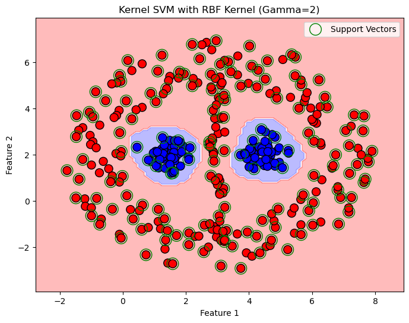

# SVM Project: Hard Margin & Kernelized SVM Implementation using CVXPY

This repository contains the implementation of Support Vector Machine (SVM) models as part of a project, focusing on:

- **Part 1:** Hard Margin SVM (Primal formulation)  
- **Part 2:** Kernelized SVM (Dual formulation) with RBF kernel

Both models are implemented using Python, with **CVXPY** for convex optimization and **NumPy**, **Pandas**, and **Matplotlib** for data handling and visualization.


<p align="center">
  
</p>

## Project Overview

### 1. Hard Margin SVM (Primal Problem)

- Formulates and solves the primal optimization problem for a linearly separable dataset.
- Finds the optimal weight vector $w$ and bias $b$.
- Identifies support vectors as points lying exactly on the margin.
- Visualizes:
  - Data points colored by class.
  - Decision boundary.
  - Margins (boundaries of the margin).
  - Support vectors highlighted.

### 2. Kernelized SVM (Dual Problem) with RBF Kernel

- Solves the dual SVM optimization problem using an RBF kernel matrix.
- Uses CVXPY to maximize the dual objective with constraints.
- Extracts support vectors based on non-zero Lagrange multipliers $\alpha$.
- Computes the bias term $b$ from support vectors.
- Defines a prediction function using support vectors and kernel values.
- Evaluates classification accuracy on training data.
- Visualizes:
  - Data points.
  - Support vectors.
  - Decision boundary in input space using contour plots.

---

## Files and Dependencies

- `dataset-Q5-1.csv`: Dataset for the primal Hard Margin SVM.
- `dataset-Q5-2.csv`: Dataset for the dual Kernelized SVM.
- Python scripts implementing both SVM models.
- Dependencies:
  - Python 3.7+
  - `numpy`
  - `pandas`
  - `matplotlib`
  - `scikit-learn`
  - `cvxpy`

Install dependencies using:

```bash
pip install numpy pandas matplotlib scikit-learn cvxpy
```

---

## Usage

### 1. Hard Margin SVM (Primal)

- Load `dataset-Q5-1.csv`.
- Run the primal SVM script:
  - Defines variables $w, b$.
  - Sets constraints $y_i (w^T x_i + b) \ge 1$.
  - Minimizes $\frac{1}{2} \|w\|^2$.
- After solving, prints $w$, $b$, and support vectors.
- Displays plot with data, decision boundary, margins, and support vectors.

### 2. Kernelized SVM with RBF Kernel (Dual)

- Load `dataset-Q5-2.csv`.
- Define the RBF kernel function with parameter $\gamma$.
- Construct kernel matrix $K$.
- Define dual variable $\alpha$.
- Solve dual maximization problem with constraints $\sum \alpha_i y_i = 0$ and $\alpha_i \ge 0$.
- Extract support vectors, compute bias term $b$.
- Define prediction function using support vectors.
- Evaluate and print training accuracy.
- Visualize data, support vectors, and decision boundary.

---

## Results Summary

- **Hard Margin SVM:**
  - Successfully separated the linearly separable dataset.
  - Correctly identified support vectors.
  - Visualization shows clear margins and decision boundary.

- **Kernelized SVM:**
  - Achieved 100% training accuracy on `dataset-Q5-2` by tuning $\gamma$.
  - Support vectors correctly identified via $\alpha_i > 1e{-5}$.
  - Decision boundary adapts nonlinearly to data distribution.
  - Visualization shows soft margins appropriate for nonlinear separation.

---

## Additional Notes

- The RBF kernel parameter $\gamma$ was tuned manually to achieve perfect accuracy.
- For larger datasets or more complex kernels, more advanced solvers or libraries (e.g., `scikit-learn`'s SVM) might be more efficient.
- This implementation is educational to demonstrate formulating and solving SVM optimization problems with CVXPY.

---

## Contact

For questions or suggestions, feel free to open an issue or contact me via GitHub.

---

**Happy learning and coding!** 🚀